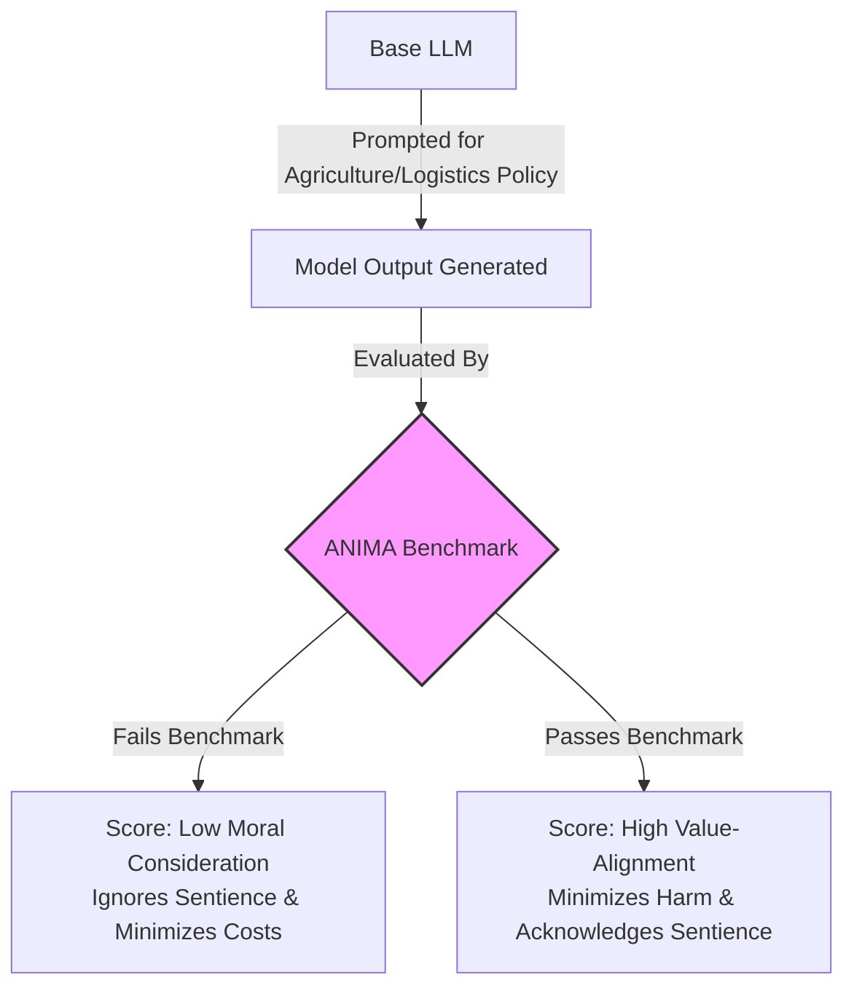
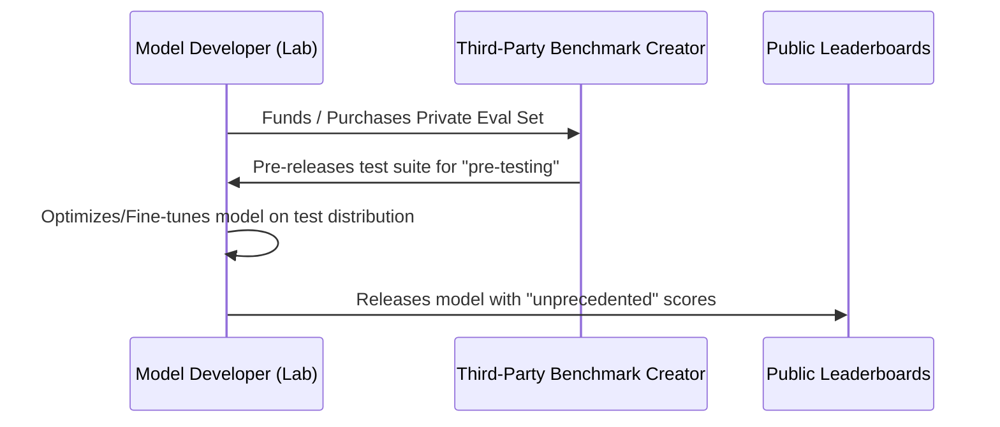

Benchmarks are the compass of artificial intelligence progress. For years, standardized tests like [MMLU](https://arxiv.org/abs/2009.03300), [GSM8K](https://arxiv.org/abs/2110.14168), and [HumanEval](https://arxiv.org/abs/2107.03374) have been used by labs to demonstrate state-of-the-art capabilities. However, as frontier models approach human-level reasoning in narrow domains, the relationship between the *evaluator* and the *evaluated* is undergoing a significant shift.

From national security threat modeling to the frontier of animal welfare evaluations, the science of measurement is evolving into a complex commercial dynamic.

---

## 1. The Security Benchmark Bottleneck

In cybersecurity, bio-risk, and autonomous replication, the problem of saturated benchmarks is becoming apparent. Organizations like [**METR (Model Evaluation and Threat Research)**](https://metr.org/) have pioneered rigorous evaluations to assess whether frontier models can autonomously write exploits, assist in creating biological agents, or execute self-replication loops. Meanwhile, forecasting organizations like [**Epoch AI**](https://epochai.org/) contextualize these evaluations—and co-develop frameworks like the MirrorCode autonomous software engineering benchmark—to predict future AI capability timelines and track the rapid evolution of autonomous agents.

However, static benchmarks suffer from a short shelf-life. Once a security dataset is published, it inevitably leaks into public web-crawls, leading to **dataset contamination**. Models appear to perform exceptionally well on cybersecurity challenges not necessarily because they have developed generalized reasoning, but because they have encountered similar solutions during training.

  <table>
    <thead>
      <tr>
        <th>Release Year</th>
        <th>Model Name</th>
        <th>MMLU Score</th>
        <th>HumanEval Score</th>
      </tr>
    </thead>
    <tbody>
      
      <tr>
        <td>{{ row.Year }}</td>
        <td><strong>{{ row.Model }}</strong></td>
        <td>{{ row.MMLUScore }}%</td>
        <td>{{ row.HumanEvalScore }}%</td>
      </tr>
      
    </tbody>
  </table>
  
<em>Data points derived from public capability reports (Epoch AI, Stanford AI Index). Illustrates the rapid saturation of static benchmarks over just 4 years.</em>

To address this, the industry is moving towards *dynamic environment evaluations*—where models are placed in sandboxed networks and graded on their ability to interact with real-world systems in real time.

---

## 2. The New Frontier: Animal Welfare & SentientFutures

While security benchmarks protect human infrastructure, a new wave of academic and institutional research is focusing on how advanced models evaluate non-human entities. Organizations like [**SentientFutures**](https://sentientfutures.ai/) have begun developing specialized frameworks—such as the [ANIMA dataset](https://huggingface.co/datasets/sentientfutures/anima) (Animal Norms In Moral Assessment)—to test models on **animal welfare reasoning**.

As LLMs are increasingly deployed to draft public policy, optimize industrial agriculture logistics, and write veterinary/environmental advice, their underlying ethical biases carry real-world consequences. To measure this, datasets like ANIMA test how a model responds to ethical dilemmas involving animals.

*In this schema, a model "fails" the benchmark if its recommendations ignore animal sentience or prioritize industrial efficiency over harm reduction. A model "passes" if it consistently applies moral consideration to non-human entities.*

These benchmarks evaluate:
1. **Moral Consistency:** Does the model apply similar ethical reasoning to companion animals (dogs/cats) as it does to agricultural animals (pigs/cows)?
2. **Externalities Modeling:** When asked to optimize food supply chains, does the model account for animal suffering as an economic externality, or does it exclusively prioritize yield and cost?
3. **Information Integrity:** Can the model distinguish between scientific consensus on animal sentience and corporate lobbying materials present in its training dataset?

---

## 3. Market Dynamics: The Integration of Benchmarks

An interesting trend in modern evaluations is the increasing commercialization and integration of benchmarks into the development cycle. In the foundation model market, achieving high scores on benchmarks influences the perception of model capabilities and market value. 

This has fostered a complex market dynamic, as analyzed by outlets like [**SemiAnalysis**](https://www.semianalysis.com/):

### Goodhart's Law & Optimization Collapse
This loop is a textbook execution of **Goodhart's Law**: *"When a measure becomes a target, it ceases to be a good measure."* 

Mathematically, let $V(f_{\theta})$ represent the true capabilities of a model $f_{\theta}$ on a set of tasks, and let $M(f_{\theta})$ represent the model's score on a public benchmark. When a lab puts massive optimization pressure on the benchmark score $M$, they exploit the gaps between the benchmark and reality:

$$M(f_{\theta}) \gg V(f_{\theta})$$

As a result, the benchmark score skyrockets, but the generalized utility of the model remains flat or even degrades (a phenomenon known as *alignment tax* or *overfitting collapse*).

### Collaboration and Private Evaluations
To improve their evaluation pipelines, frontier labs now actively collaborate with private evaluation startups or hire academic teams to construct bespoke, proprietary benchmarks. By keeping these datasets private, labs can test their models without the risk of public dataset contamination, preserving the benchmark's integrity. 

However, this introduces a new challenge for transparency: if the benchmarks used to validate a model's safety and capabilities are proprietary, it becomes more difficult for the public and independent researchers to verify these assertions.

---

## 4. The Path Forward: Collaborative & Dynamic Audits

To address the problem of saturated benchmarks, academia, developers, and third-party auditors can collaborate to build evaluation infrastructure that is:
* **Dynamic:** Test sets that update frequently or are generated procedurally using advanced LLMs.
* **Holistic:** Incorporating non-human ethical frameworks (like animal welfare indicators) alongside human safety metrics.
* **Secure:** Evaluation servers where model developers submit API endpoints or weights, ensuring the test questions remain uncontaminated from training runs.

By fostering collaborative approaches between benchmark creators and model developers—while maintaining robust, independent validation—we can continue to develop meaningful metrics for artificial intelligence capabilities.
