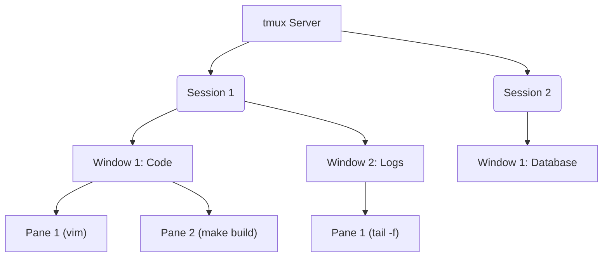

If you spend any significant time in the terminal, you’ve probably heard of **tmux** (Terminal Multiplexer). It is one of the most powerful tools in a developer's toolkit, yet it has a notoriously steep learning curve.

This guide is designed to take you from a complete tmux beginner to a power user. We will cover the core concepts, walk through everyday usage, explain the trickier parts (like scrollback and copy-paste), show you how to customize it, and wrap it all up with an easy-to-reference cheatsheet.

---

## What is tmux and Why Do You Need It?

`tmux` stands for **Terminal Multiplexer**. It allows you to spin up multiple terminal sessions, window layouts, and split panes from a single terminal window.

Here are the three primary reasons you should use tmux:

1. **Session Persistence (Detaching/Attaching):** You can start a process on a remote server, close your laptop, commute home, reconnect to the server, and attach back to the exact state you left it.
2. **Layout Management (Panes and Windows):** You can split your screen horizontally or vertically, run your server log in one pane, code editor in another, and database console in a third.
3. **Multi-window workflow:** You can organize tasks into separate "windows" (similar to browser tabs) within a single terminal.

---

## Core Concepts: Sessions, Windows, and Panes

Before pressing any keys, it is crucial to understand the hierarchical structure of tmux:



* **Session:** A single workspace. A session persists even if you disconnect. You can have multiple sessions running simultaneously.
* **Window:** Inside a session, you can have multiple windows. Think of these as tabs in a web browser. A window takes up the entire screen.
* **Pane:** Inside a window, you can split the screen into multiple rectangular sections called panes. Each pane runs its own shell.

---

## Getting Started

### 1. Installation

Install tmux using your system's package manager:

* **macOS:** `brew install tmux`
* **Ubuntu/Debian:** `sudo apt install tmux`
* **Fedora/CentOS:** `sudo dnf install tmux`
* **Arch Linux:** `sudo pacman -S tmux`

### 2. The Prefix Key

To tell tmux that you are talking to *it* rather than the shell inside your pane, you must press a special key combination first. This is called the **Prefix Key**.

By default, the prefix key is:
$$\mathbf{Ctrl} + \mathbf{b}$$
*(Often written in documentation as `C-b`)*

**How to use shortcuts:**
To run a shortcut like `C-b c` (create window):
1. Press `Ctrl` and `b` together.
2. Release both keys.
3. Press `c` quickly.

---

## Session Management

Sessions are the highest level of tmux organization. You manage them using both terminal commands (from outside tmux) and shortcuts (from inside tmux).

### Terminal Commands (From Outside tmux)

| Action | Command |
| :--- | :--- |
| Start a new session | `tmux` |
| Start named session | `tmux new -s <session_name>` |
| List running sessions | `tmux ls` |
| Attach to last session | `tmux a` (or `tmux attach`) |
| Attach to named session | `tmux a -t <session_name>` |
| Rename a session | `tmux rename-session -t <old> <new>` |
| Kill a specific session | `tmux kill-session -t <session_name>` |
| Kill all sessions | `tmux kill-server` |

### Shortcuts (From Inside tmux)

Always press `C-b` before these keys:

* `$` — Rename the current session.
* `d` — Detach from the current session (leaves it running in the background!).
* `s` — Open an interactive list of all sessions to switch between them.
* `(` — Switch to the previous session.
* `)` — Switch to the next session.

---

## Window Management

Windows act like tabs. You use them to separate completely different tasks (e.g., one window for backend code, one for frontend, one for deployment).

Always press `C-b` before these keys:

* `c` — Create a new window.
* `,` — Rename the current window.
* `n` — Move to the **n**ext window.
* `p` — Move to the **p**revious window.
* `0` to `9` — Switch to window by index number.
* `w` — Choose a window interactively from a list.
* `&` — Kill (close) the current window.
* `f` — Find window by name.

---

## Pane Management

Panes let you split your workspace screen. This is where the power of tmux really shines.

Always press `C-b` before these keys:

### Splitting and Closing

* `%` — Split pane **vertically** (splits left/right).
* `"` — Split pane **horizontally** (splits top/bottom).
* `x` — Close (kill) the current pane.

### Navigation

* `o` — Rotate focus through all panes in the current window.
* `Arrow Keys` — Navigate to the pane in the direction of the arrow.
* `;` — Toggle back to the last active pane.
* `q` — Show pane numbers briefly (press a number to jump directly to that pane).

### Layout and Resizing

* `z` — **Zoom/Unzoom** the current pane. (Expands it to take up the full window; press `C-b z` again to shrink it back).
* `Ctrl + Arrow Keys` — Resize the current pane in directions of arrows (increments of 1 cell).
* `Alt + Arrow Keys` — Resize the current pane in directions of arrows (increments of 5 cells).
* `Spacebar` — Cycle through default tmux pane layouts (even-horizontal, even-vertical, main-horizontal, main-vertical, tiled).
* `!` — Convert the current pane into a brand new window.
* `join-pane -t :<window_index>` — (Run in tmux command mode: `Prefix + :`) Joins current pane to another window.

---

## Copy Mode & Scrollback

If you try to scroll up in tmux using your mouse wheel or touchpad, you will quickly notice that it either doesn't work or scrolls your terminal emulator's buffer instead of the tmux active window.

To scroll and copy text, tmux uses **Copy Mode**.

### 1. Entering Copy Mode
Press `C-b [` to enter copy mode. A counter will appear in the top-right corner showing your position in the scrollback buffer.

### 2. Navigating
By default, tmux uses Emacs-style keybindings, but most developers prefer **vi** mode. You can navigate the buffer using:
* `Up / Down / Left / Right` arrows.
* `PageUp / PageDown` to scroll by page.

*If you configure vi keys (see configuration below):*
* `k` / `j` / `h` / `l` — Move cursor up / down / left / right.
* `w` / `b` — Jump forward / backward by word.
* `g` — Go to top line.
* `G` — Go to bottom line.
* `/` — Search forward.
* `?` — Search backward.

### 3. Copying and Pasting

1. Move your cursor to the start of the text you want to copy.
2. Press `Spacebar` (or `v` if in vi mode) to start selection.
3. Use navigation keys to highlight the text.
4. Press `Enter` (or `y` if in vi mode) to copy the text into the tmux buffer.
5. Exit copy mode by pressing `q` or `Escape`.
6. To paste the copied text elsewhere in tmux, press:
   $$\mathbf{Ctrl} + \mathbf{b} \quad \text{then} \quad \mathbf{]}$$

---

## Customizing tmux (`.tmux.conf`)

tmux is highly customizable. You configure it by creating a file named `.tmux.conf` in your home directory (`~/.tmux.conf`).

Here is a recommended, clean config file containing the most popular quality-of-life adjustments.

```tmux
# ==========================================
# ~/.tmux.conf
# ==========================================

# 1. Change prefix from Ctrl+b to Ctrl+a (Many find Ctrl+a easier to reach)
unbind C-b
set-option -g prefix C-a
bind-key C-a send-prefix

# 2. Enable mouse support (Allows clicking to select panes, resizing, and scrolling)
set -g mouse on

# 3. Use vi-keys in copy mode
set-w -g mode-keys vi

# 4. Easy config reload shortcut
bind r source-file ~/.tmux.conf \; display-message "tmux config reloaded!"

# 5. Start window and pane numbering at 1 (instead of 0)
set -g base-index 1
setw -g pane-base-index 1

# 6. Improve colors
set -g default-terminal "screen-256color"

# 7. Split panes using visual | and -
bind | split-window -h
bind - split-window -v
unbind '"'
unbind %

# 8. Switch panes using Alt-arrow without prefix
bind -n M-Left select-pane -L
bind -n M-Right select-pane -R
bind -n M-Up select-pane -U
bind -n M-Down select-pane -D

# 9. Increase scrollback buffer limit
set -g history-limit 10000
```

### Applying Changes
To apply configuration changes without restarting tmux, press `Prefix + :` to enter command mode, type `source-file ~/.tmux.conf`, and press `Enter`. (Or press `Prefix + r` if you copied the config above).

---

## The Ultimate tmux Cheatsheet

Here is a quick-reference table summarizing everything. Keep this bookmarked!

### Session Operations

| Shortcut | Description |
| :--- | :--- |
| `tmux` | Start a new session |
| `tmux new -s <name>` | Start a new session named `<name>` |
| `tmux a` | Attach to the last active session |
| `tmux a -t <name>` | Attach to session named `<name>` |
| `tmux ls` | List all active sessions |
| `C-b d` | Detach from the current session |
| `C-b s` | Interactively list and switch sessions |
| `C-b $` | Rename current session |

### Window Operations (Tabs)

| Shortcut | Description |
| :--- | :--- |
| `C-b c` | Create a new window |
| `C-b ,` | Rename current window |
| `C-b n` | Switch to next window |
| `C-b p` | Switch to previous window |
| `C-b 0..9` | Switch to window by index |
| `C-b w` | Select window interactively |
| `C-b &` | Close current window |

### Pane Operations (Splits)

| Shortcut | Description |
| :--- | :--- |
| `C-b %` | Split vertically (left/right) |
| `C-b "` | Split horizontally (top/bottom) |
| `C-b o` | Switch to next pane |
| `C-b <Arrow>` | Switch pane in direction of arrow |
| `C-b z` | Zoom current pane to full screen |
| `C-b x` | Close current pane |
| `C-b !` | Convert pane into a new window |
| `C-b Ctrl+<Arrow>` | Resize pane by 1 cell |
| `C-b Alt+<Arrow>` | Resize pane by 5 cells |
| `C-b Space` | Cycle through default pane layouts |

### Copy Mode Operations

| Shortcut | Description |
| :--- | :--- |
| `C-b [` | Enter Copy Mode |
| `q` | Exit Copy Mode |
| `Space` / `v` | Start selecting text |
| `Enter` / `y` | Copy selected text |
| `C-b ]` | Paste copied text |

---

## Pro-Tips for Power Users

1. **Tmuxinator:** If you have complex project setups (e.g., starting a database, runner, log tailer, and editor), check out [Tmuxinator](https://github.com/tmuxinator/tmuxinator). It lets you define layouts in YAML and boot them up with a single command.
2. **Tmux Resurrect & Continuum:** If your machine restarts, you lose your tmux environment. Plugins like [tmux-resurrect](https://github.com/tmux-plugins/tmux-resurrect) and [tmux-continuum](https://github.com/tmux-plugins/tmux-continuum) automatically save and restore your session layouts, open directories, and running programs.
3. **Control Mode (`tmux -CC`):** This runs tmux under control mode, allowing terminal emulators like iTerm2 or Alacritty to integrate directly with tmux. You can use native macOS windows/tabs, but they run inside tmux on the remote server!

Now go ahead, open your terminal, type `tmux`, and start experimenting!
